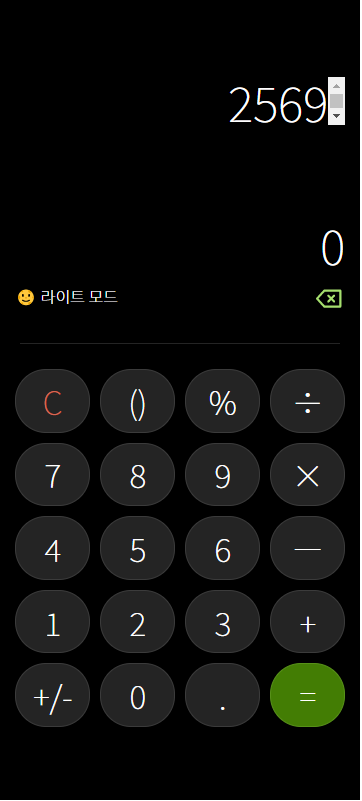

# IHFB Assignment

## 🙋🏻‍♂️Applicant

**Jung Young Jun**

[](https://avatars.githubusercontent.com/u/83502672?v=4)

[github](https://github.com/dudwns0921)

## 📒Usage

### 개발 모드로 실행하기

```
> npm run start
```

## ⚡프로젝트 개요

**React**를 활용해 만든 계산기 앱입니다. 프로젝트 구조는 아래와 같습니다.


- ### Input : React로 만든 Keypad에 해당

- ### Calculator : Class로 만든 계산기 인스턴스

- ### Display : React로 만든 계산기 화면 부분에 해당

___

1. 사용자가 **Input**에서 숫자와 연산자를 입력
2. **Calculator**에서 숫자와 연산자로 수식을 만들거나 해당 수식을 계산해 결과를 도출
3. **Display**는 **Calculator**에서 만든 수식이나 도출된 결과를 화면에 출력

**Calculator**에서는 `eval()`을 사용할 수 없고, 사칙연산의 우선순위를 반영해야 하기 때문에 중위 표기법으로 입력된 수식을 후위 표기법으로 바꿔서 계산을 진행합니다.

## ⚙기능

### 사칙연산 계산

문자열로 입력된 수식을 후위표기법으로 바꿔서 계산하기 때문에 긴 수식이라도 모두 계산이 가능합니다.

			

음수도 계산 가능합니다.

		

소수도 계산 가능합니다.

	`

### 지우기

입력한 수식을 뒤에서부터 한 칸씩 지웁니다.

				

### 초기화

입력한 수식을 모두 초기화합니다.

		

### 부호변경

입력한 숫자의 부호를 변경합니다. 

				

## 🤔기타 참고사항

아직 완벽하게 구현된 상태는 아니며 자세한 구현 내용은 Pull Request를 참고 부탁드립니다.


